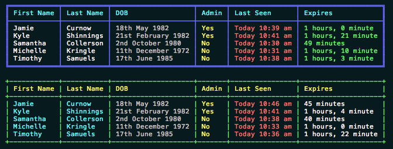

CLI Table Output for PHP
================================================



- Nice table output of data rows
- Columns adjust to data size
- Data manipulators for fields, formats raw data to a nice display output
- Colors! When specifying a color, choose from these strings: blue, red, green,
  yellow, black, magenta, cyan, white, grey
- Support for multi-line values.

### Installing via Composer

```bash
# Install Composer
curl -sS https://getcomposer.org/installer | php
```

Next, run the Composer command to install the latest stable version:

```bash
composer.phar require jc21/clitable
```

After installing, you need to require Composer's autoloader:

```php
require 'vendor/autoload.php';
```

### Using

[Class documentation](docs/Documentation.md)

See the tests folder for some examples, but basically here's how to use it:

```php
use jc21\CliTable;

// $data used below is an array of rows with fields. See tests/data.php for an example.

$table = new CliTable;
$table->setTableColor('blue');
$table->setHeaderColor('cyan');
$table->addField('First Name', 'firstName',    false,                               'white');
$table->addField('Last Name',  'lastName',     false,                               'white');
$table->addField('DOB',        'dobTime',      new CliTableManipulator('datelong'));
$table->addField('Admin',      'isAdmin',      new CliTableManipulator('yesno'),    'yellow');
$table->addField('Last Seen',  'lastSeenTime', new CliTableManipulator('nicetime'), 'red');
$table->addField('Expires',    'expires',      new CliTableManipulator('duetime'),  'green');
$table->injectData($data);
$table->display();
```

### Manipulators

These are the manipulators provided in the package:

- dollar: Formats 12300.23 to $12,300.23
- date: Formats unix timestamp 1372132121 to AU date 25-06-2013 (because I'm an Aussie mate)
- datelong: Formats unix timestamp 1372132121 to 25th June 2013
- time: Formats unix timestamp 1372132121 to 1:48 pm
- datetime: Formats unix timestamp 1372132121 to 25th June 2013, 1:48 pm
- nicetime: Formats unix timestamp 1372132121 to one of the following, depending if it falls on Today or Yesterday or earlier:
  - Today, 1:48 pm
  - Yesterday, 1:48 pm
  - 25th June 2013, 1:48 pm
- duetime: Formats unix timestamp to x years x days x hours x minutes x seconds
- nicenumber: Formats 123456 to 123,456
- month: Formats unix timestamp 1372132121 to June
- year: Formats unix timestamp 1372132121 to 2013
- monthyear: Formats unix timestamp 1372132121 to June 2013
- percent: Formats 54 to 54%
- yesno: Formats a boolean value to Yes or No
- text: Strips HTML from the value before returning

If you want to create your own manipulators:

```php
class MyManipulator extends CliTableManipulator {
	public function chucknorris($value)
	{
		return 'Chuck norris said: ' . $value;
	}
}

$table = new CliTable;
$table->setTableColor('blue');
$table->setHeaderColor('cyan');
$table->addField('First Name', 'firstName',    false,                               'white');
$table->addField('Last Name',  'lastName',     false,                               'white');
$table->addField('DOB',        'dobTime',      new CliTableManipulator('datelong'));
$table->addField('Admin',      'isAdmin',      new MyManipulator('chucknorris'),    'yellow');
$table->addField('Last Seen',  'lastSeenTime', new CliTableManipulator('nicetime'), 'red');
$table->addField('Expires',    'expires',      new CliTableManipulator('duetime'),  'green');
$table->injectData($data);
$table->display();
```
